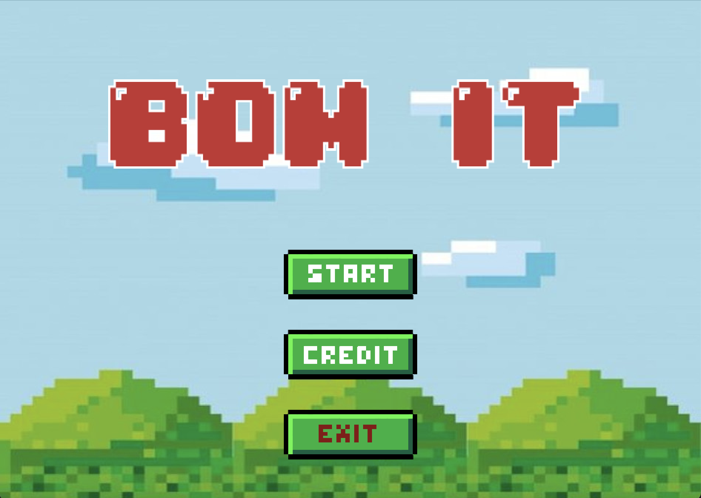
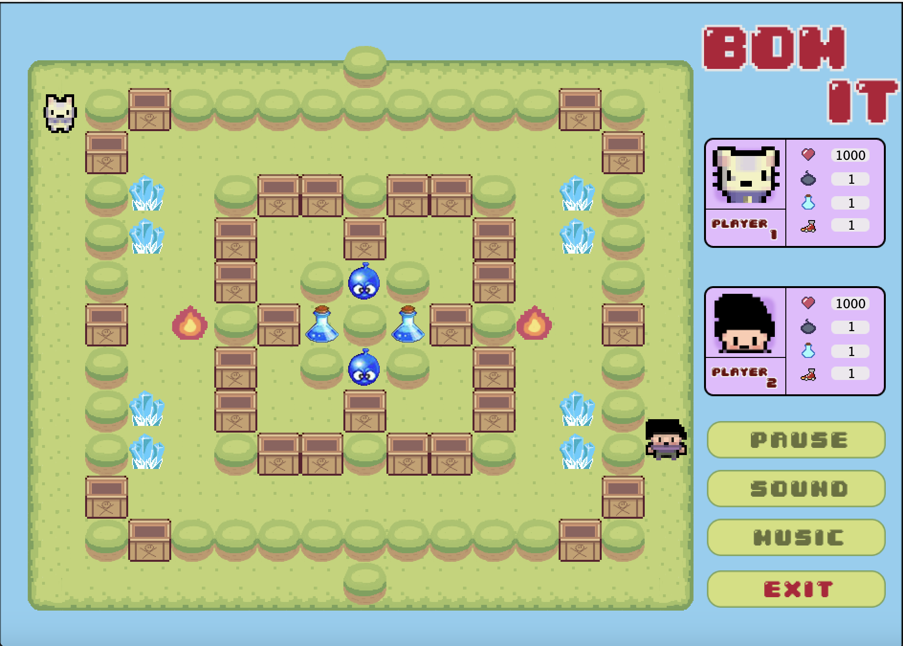
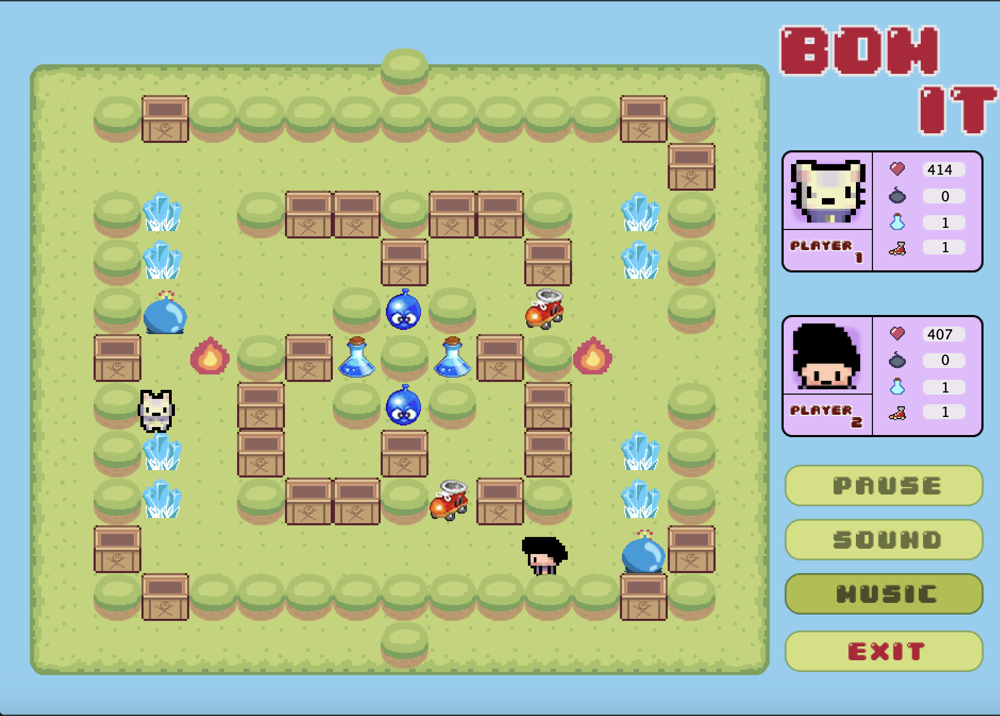
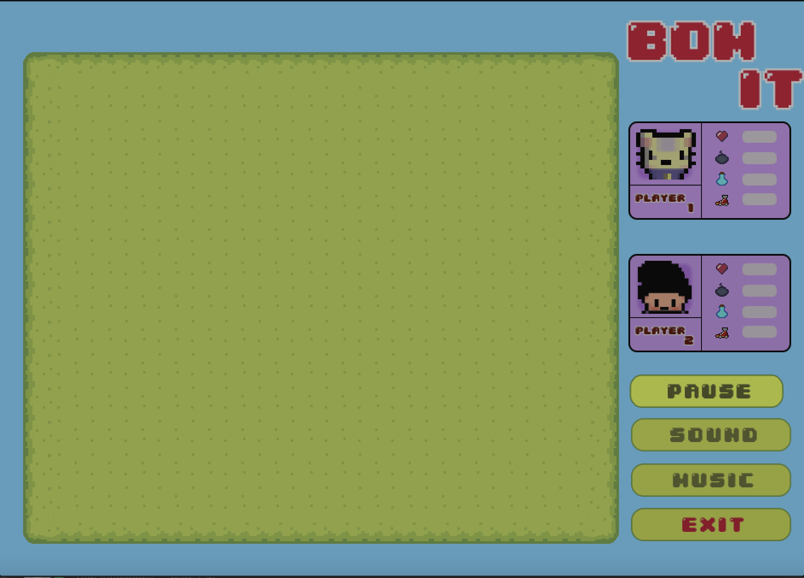
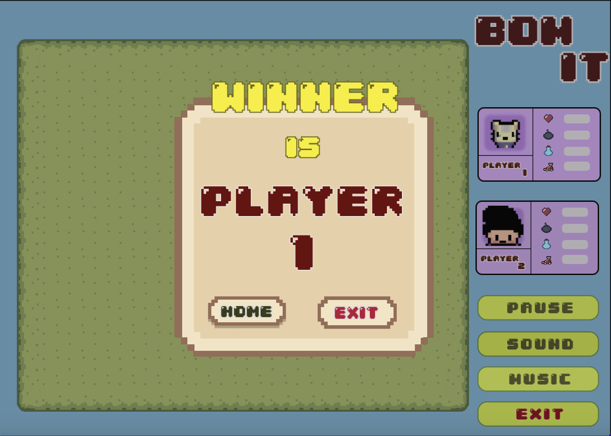
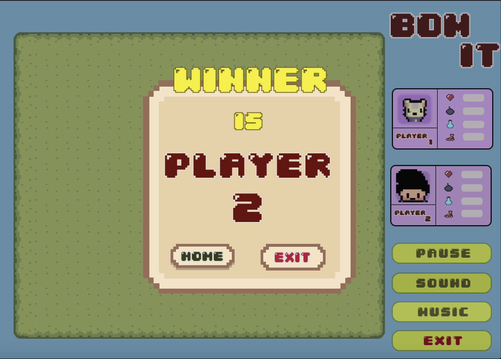

# BOM IT
Click here to see our game presentation --> https://www.youtube.com/watch?v=ZAQBnsRF2-U&t=16s

# Table of contents :

1. [Introduction](#introduction)
2. [Demonstration](#demonstration)
3. [Design class](#design)
4. [UML Class Diagram](#uml)
5. [Extra features](#extrafeature)
6. [Demo](#demo)
7. [References](#references)

## Introduction  
### Group: 16
### Our team member
| Index | Name                   |     ID      |              Email               | Github             |
|:------|:-----------------------|:-----------:|:--------------------------------:|:---------------------------|
| 1     | Nguyễn Huỳnh Thảo My | ITCSIU21204 | thaomypc2003@gmail.com | my003 |
| 2     | Đỗ Đình Phúc | ITCSIU21219 | phucdo2912@gmail.com | dodinhphuc |
| 3     | Nguyễn Trần Nguyên Anh  | ITITWE20021 | ntna010302@gmail.com |   Ntna1302 |
| 4     | Lê Thu Hoàng| ITCSIU21063 | thisishoangf@gmail.com | thuhoangle |           

### Tasks and Contribution 
| Index | Role                                                         | Person In Charge | Contribution |
|:------|:-------------------------------------------------------------|:--------------:|:------------:|
| 1     | Leader     |   Đình Phúc   |          30%      |
| 2     | Member      |   Thảo My    |          25%      |
| 3     | Member  |  Nguyên Anh     |      22,5%          |
| 4     | Member |     Thu Hoàng     |          22,5%      |  

| Name | Tasks |
|:------|:-------------------------------------------------------------|
| Thảo My      |  Design the control screen switching, add the sound and effect |   
| Đình Phúc  |   Design classes, DSA for game structure    |    
| Thu Hoàng | Gameplay Designer, UI Artist(map, elements, and audio)|     
| Nguyên Anh | Gameplay Designer, UI Artist (player, elements, report, slide) |      

Design Pattern:

- MVC (Model-View-Controller) 
- Observer 
- State 
## Features  
**Main Feature:**  
- Play, Pause
- Bom explosion, items collection
- Playfield

**Extra feature:**  
- Game Speed, MultiThread
- UI (Music and sound effects)
- Characters and Map are drawn manually

## UML Class Diagram  

## Demo   

#### Start Screen  

#### Play Screen 

#### Pause Screen 

#### End Screen 

## Installation
Step 1: Access to [BOM IT](https://github.com/my003/Begining_process.git)
Download and unzip the file
Clone the following repository to your local.

Copy the repository URL --> Open VSCode/InteliJ --> Ctrl + Shift + P --> Type "gitcl" --> Choose "Git Clone" and paste the URL

Step 2: Run the .jar file

## References  
[1] YouTube.com: Java Game Development Tutorial - Kaarin Gaming

[2] “Free Music Pack by Clement Panchout.” Clement Panchout, 
https://clement-panchout.itch.io/yet-another-free-music-pack

[3] How to create menu and screen - Platformer tutorial java - Kaarin gaming
https://www.youtube.com/watch?v=6_N8QZ47toY&list=PL4rzdwizLaxYmltJQRjq18a9gsSyEQQ-0

